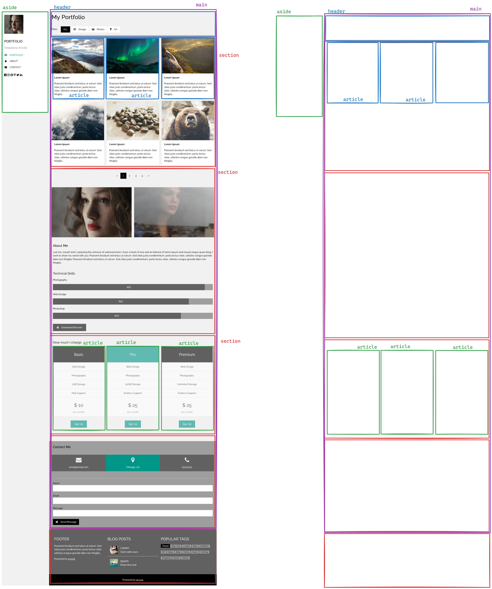

# Portafolio personal
**Vamos a realizar un portfolio personal usando HTML, CSS y flexbox, aplicando todo el contenido que vimos en clase.**

La idea es que este proyecto sirva a modo de trabajo final de curso, a medida que avancemos iremos aplicando conceptos para tener un trabajo real y completo.

## Consigna
Desarrollar un portafolio de trabajos usando html y css, estilizando el contenido con las propiedades que fuimos desarrollando en clase y generando la estructura visual (ubicacion de elementos) mediante flexbox en css.

### Referencias
Vamos a utilizar este template a modo de referencia **[link al modelo a usar](https://www.w3schools.com/w3css/tryw3css_templates_portfolio.htm)**

Las imagenes (por ejemplo las de perfil) pueden usar las suyas o descargar las que ya se encuentran en uso en la referencia.

`` Las imagenes podes descargarlas y agregarlas a tu proyecto o utilizar la URL directamente del sitio de ejemplo, yo recomiendo descargarlas para que ya queden en nuestros archivos. ``

### Estructura
En clase ya definimos una estructura básica de como va a ser el sitio

Para verla a tamaño completo puedes
**[verla desde aqui](imagenes/consigna/estructura.png)**

## Tareas
Dejo aqui el listado de trabajos que tenemos que ir desarrollando sobre el proyecto

- [x] Analizar el sitio y generar la estructura inicial
- [x] Crear el proyecto y estilizar lo básico
- [ ] Solucionar el problema del aside `` detallado más abajo ``
- [ ] Crear las tarjetas de trabajos  *(no hacer, lo haremos en clase)*
- [ ] Crear la seccion "sobre mi" *(no hacer, lo haremos en clase)*
- [ ] Crear la seccion "costos" *(no hacer, lo haremos en clase)*

> ***problema del aside:***
El aside segun el ejemplo tiene que quedar fijo arriba a la izquierda a medida que se scrollea el contenido, pero ese contenido tiene que estar desplazado hacia la derecha por el mismo aside, cosa que en este momento no esta funcionando.